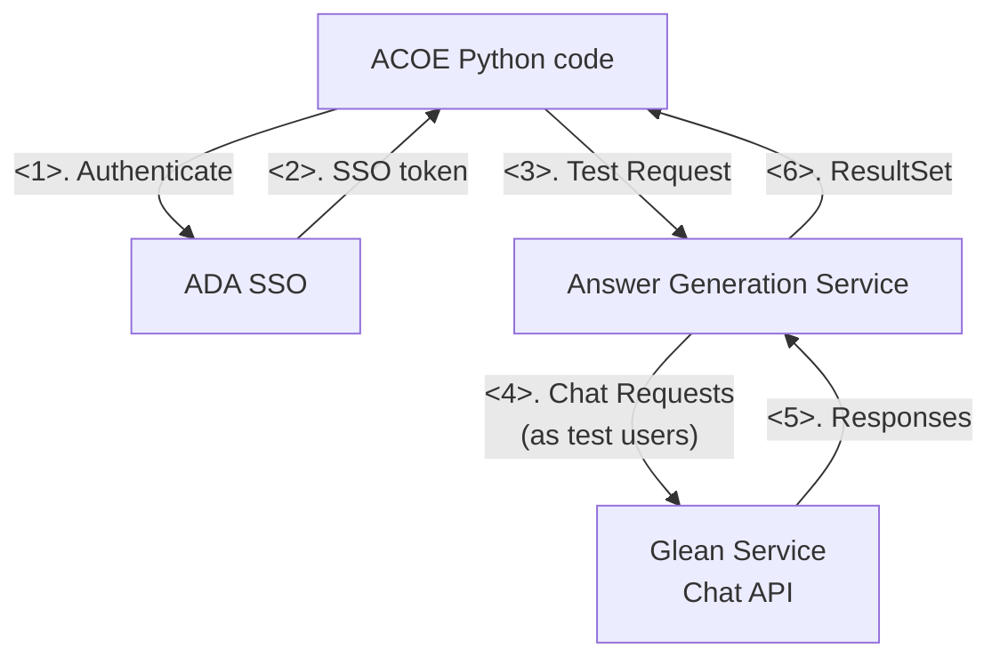
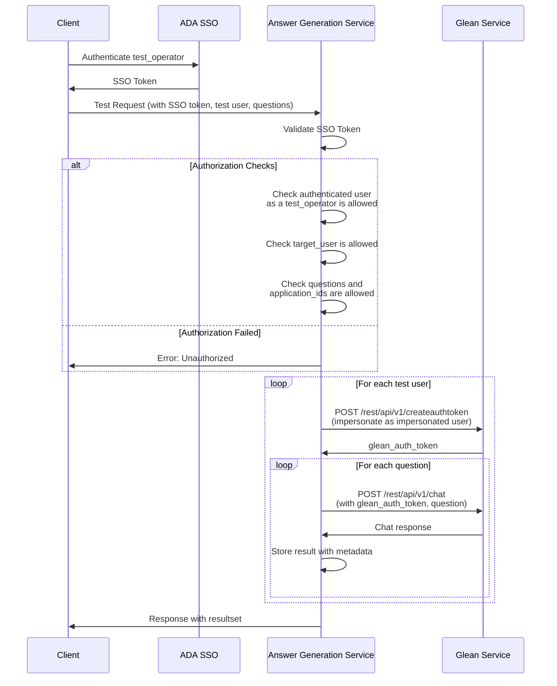

# Answer Generation Service Architecture

## Overview
This document describes the architecture for an automated testing service that collect Glean chat answers using multiple target_user accounts and predefined questions.

## Requirements
- around 20 test users for automated answer generation (target_users)
- around 4 authorized users who can call this API (test_operators)
- around 200 predefined questions for answer generation
  - (~30 questions per use case) x (6 use cases) = 180 questions
- Automated collection of answers in json format returned by response
- Configurable target users and questions and application ids

## High-Level Architecture



## Component Details

### Client
- Authenticate test_operator and get SSO token
- Call Answer Generation Service to perform tests

### ADA SSO
- Handle authentication and return SSO token

### Answer Generation Service
Main orchestration service with the following modules

### Glean Service
- Target service being tested
- Provides chat API and authentication endpoints

## Authentication & Authorization Flow



## Data Structures

### Request Format
```json
{
  "user": "target_user_1",
  "application_id": "ai_app_1",
  "questions": [
    "What is machine learning?",
    "What is machine MCP?",
    "What is machine Agent?",
    "How does neural network training work?"
  ]
}
```

### Response Format
```json
{
  "test_id": "uuid-12345",
  "timestamp": "2024-01-01T00:00:00Z",
  "operated_by": "test_operator1",
  "target_user_id": "target_user_1",
  "application_id": "ai_app_1",
  "status": "completed",
  "results": [
    {
      "question": "What is machine learning?",
      "answer": "Machine learning is a subset of artificial intelligence...",
      "citation_urls": [
        "https://internal-docs.com/ml-overview",
        "https://wiki.company.com/ai-basics"
      ],
      "response_time_ms": 1500,
      "timestamp": "2024-01-01T00:00:01Z",
      "status": "success",
      "statusMsg": None
    },
  ]
}
```

## Configuration Management

### Answer Generation Use Cases
```yaml
answer_generation:
  usecases:
    - id: usecase_id_1
      users:
        - user_1
        - user_2
        - user_3
      questions:
        - What is machine learning?
        - How does neural network training work?
        - What are the benefits of cloud computing?
        - How do I reset my password?
        - What is our company's mission statement?
      ai_app_ids:
        - ai_app_1
        - ai_app_2
        - ai_app_3
    - id: usecase_id_2
      users:
        - user_1
        - user_2
        - user_3
      questions:
        - How do I update my profile settings?
        - What are the system requirements for this software?
        - Can you explain data privacy policies?
        - How to troubleshoot connection issues?
        - What integrations are available?
      ai_app_ids:
        - ai_app_1
        - ai_app_2
        - ai_app_3
    - id: usecase_id_3
      users:
        - user_1
        - user_2
        - user_3
      questions:
        - Show me sales analytics for Q4
        - How to generate monthly reports?
        - What are our top performing products?
        - Can you analyze customer churn data?
        - Export user engagement metrics
      ai_app_ids:
        - ai_app_1
        - ai_app_2
        - ai_app_3
```

## Security Considerations
- All API calls authenticated through SSO
- Multi-level authorization checks:
  - test_operator must be in allowlist
  - target_user must be in allowlist
  - Questions and application_ids must be pre-approved for each target_user
- Service token for Glean API stored securely (environment variable/secrets manager)
- Audit logging of all API executions