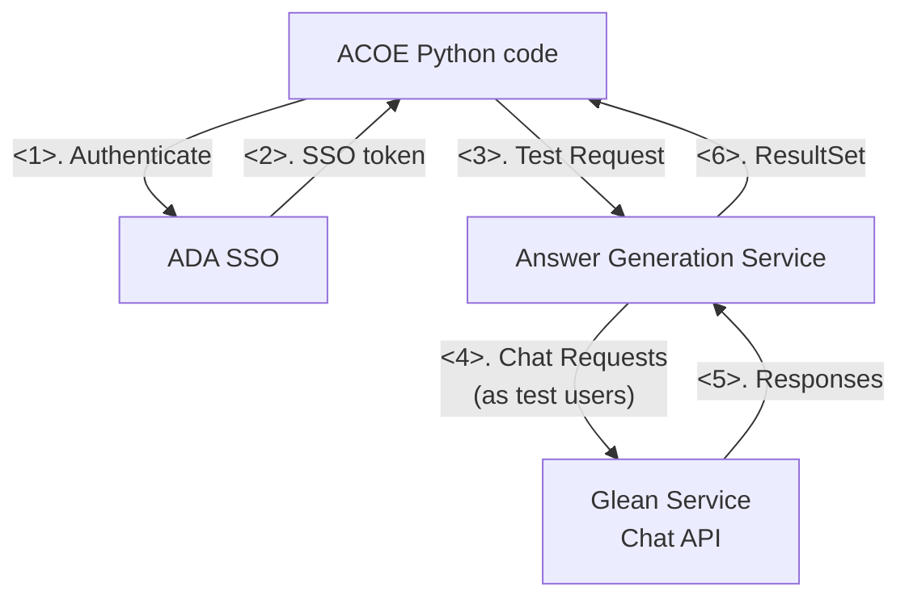
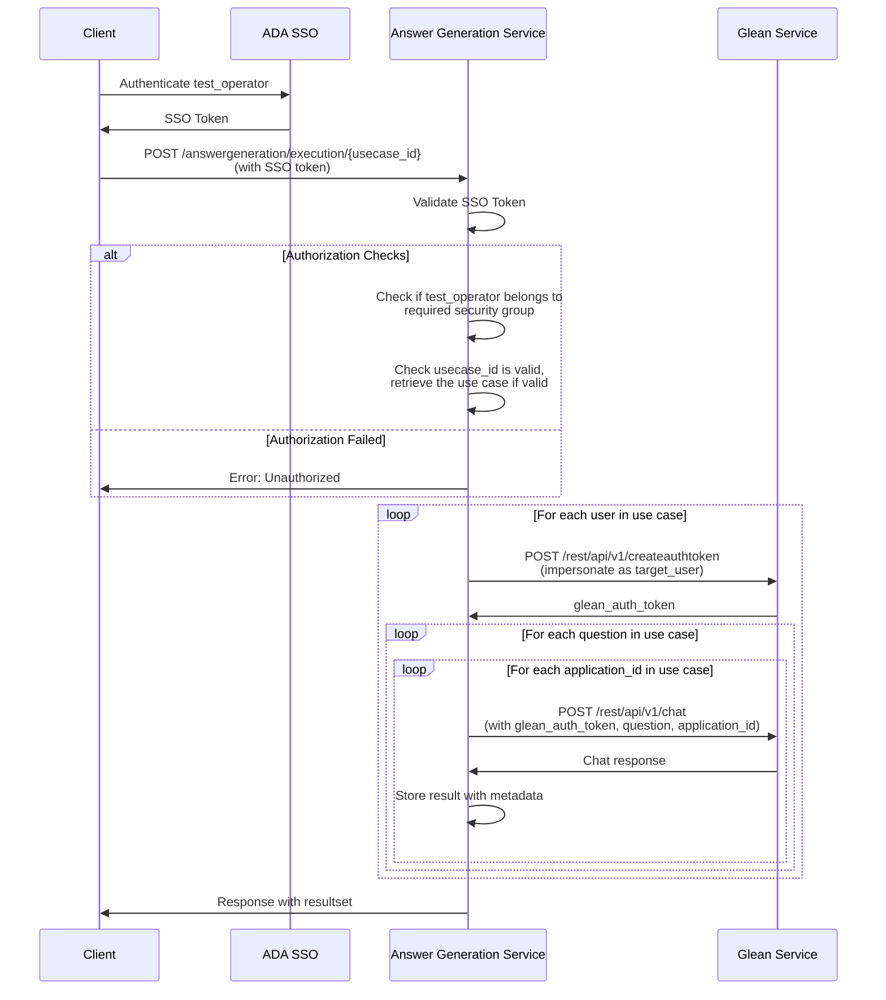

# Answer Generation Service Architecture

## Overview
This document describes the architecture for an automated testing service that collect Glean chat answers using multiple target_user accounts and predefined questions.

## Requirements
- around 6 senarios need answer generation automations (use cases)
- around 4 users (request for a security group) who can call this API (test_operators)
- Automated collection of answers in json format returned by response
- Configurable target users and questions and application ids

## High-Level Architecture



## Component Details

### Client
- Authenticate test_operator and get SSO token
- Browse available use cases via `GET /answergeneration/usecases`
- Execute specific use case via `POST /answergeneration/execution/{usecase_id}`

### ADA SSO
- Handle authentication and return SSO token

### Answer Generation Service
Main orchestration service with the following modules

### Glean Service
- Target service being tested
- Provides chat API and authentication endpoints

## Authentication & Authorization & Execution Flow



## API Endpoints

### Execute Use Case
- **Endpoint**: `POST /answergeneration/execution/{usecase_id}`
- **Description**: Execute answer generation for a specific use case
- **Path Parameters**: 
  - `usecase_id`: Use case ID that defines the users, questions, and application IDs to test
- **Request Body**: None required
- **Response**: A Result set and metadata fields
- **Authentication**: Bearer token (SSO JWT)

### Get Use Cases
- **Endpoint**: `GET /answergeneration/usecases`
- **Description**: Retrieve the complete list of available use cases
- **Request Body**: None
- **Response**: Array of UseCase objects
- **Authentication**: Bearer token (SSO JWT)


## Configuration Management

### Answer Generation Use Cases
```yaml
answer_generation:
  usecases:
    - id: usecase_id_1
      users:
        - user_1
        - user_2
        - user_3
      questions:
        - What is machine learning?
        - How does neural network training work?
        - What are the benefits of cloud computing?
        - How do I reset my password?
        - What is our company's mission statement?
      ai_app_ids:
        - ai_app_1
        - ai_app_2
        - ai_app_3
    - id: usecase_id_2
      users:
        - user_1
        - user_2
        - user_3
      questions:
        - How do I update my profile settings?
        - What are the system requirements for this software?
        - Can you explain data privacy policies?
        - How to troubleshoot connection issues?
        - What integrations are available?
      ai_app_ids:
        - ai_app_1
        - ai_app_2
        - ai_app_3
    - id: usecase_id_3
      users:
        - user_1
        - user_2
        - user_3
      questions:
        - Show me sales analytics for Q4
        - How to generate monthly reports?
        - What are our top performing products?
        - Can you analyze customer churn data?
        - Export user engagement metrics
      ai_app_ids:
        - ai_app_1
        - ai_app_2
        - ai_app_3
```

## Security Considerations
- All API calls authenticated through SSO
- Multi-level authorization checks:
  - test_operator must belong to required security group (e.g., "answer-generation-operators")
  - usecase_id must be valid and accessible to the test_operator
  - target_users must be in allowlist for the specified use case
  - Questions and application_ids must be pre-approved for each use case
- Service token for Glean API stored securely (environment variable/secrets manager)
- Audit logging of all API executions