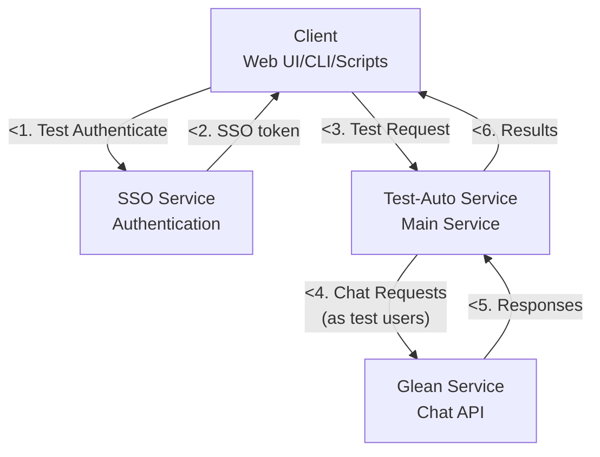
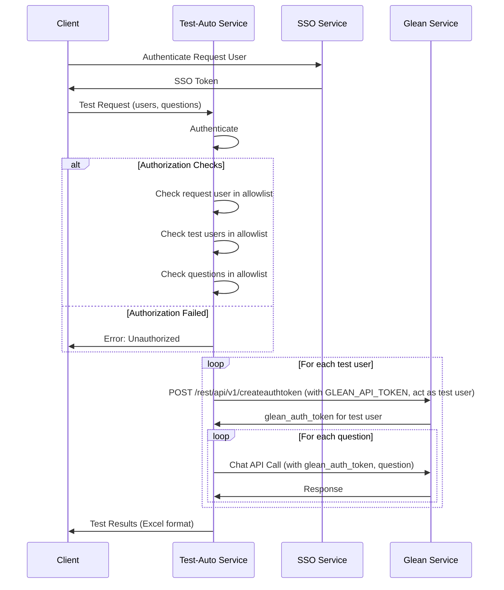

# Test Automation Service Architecture

## Overview
This document describes the architecture for an automated testing service that tests Glean chat API using multiple user accounts and predefined questions.

## Requirements
- 20 test users for automated testing
- 4 authorized users who can trigger tests
- 30 predefined questions for testing
- Automated collection of responses in Excel format
- Configurable users and questions

## High-Level Architecture



## Component Details

### Client
- authenticate test operator and get SSO token
- call Test-Auto Service to perform tests

### SSO Service
- Handle authentication and return SSO token

### Test-Auto Service
- Main orchestration service with the following modules:

### Glean Service
- Service be tested

## Authentication & Authorization Flow



## Data Structures

### Request Format
```json
{
  "user_questions": {
    "user1": ["question1", "question2", "..."],
    "user2": ["question1", "question2", "..."]
  }
}
```

### Response Format
```json
{
  "test_id": "uuid",
  "timestamp": "2024-01-01T00:00:00Z",
  "requested_by": "user_id",
  "results": [
    {
      "test_user_id": "user1",
      "question": "What is machine learning?",
      "answer": "Machine learning is...",
      "response_time_ms": 1500,
      "timestamp": "2024-01-01T00:00:01Z"
    }
  ],
  "summary": {
    "total_users": 20,
    "total_questions": 30,
    "total_responses": 600,
    "avg_response_time_ms": 1200,
    "success_rate": 98.5
  }
}
```

### Excel Export Format
| Test User ID | Question | Answer | Response Time (ms) | Timestamp |
|-------------|----------|--------|--------------------|-----------|
| user1 | What is AI? | AI is... | 1200 | 2024-01-01T00:00:01Z |
| user1 | How does ML work? | ML works by... | 1500 | 2024-01-01T00:00:02Z |

## Configuration Management

### test-operator user allowlist
```yaml
test-operator-users:
  - test-operator-user1
  - test-operator-user2
  - test-operator-user3
```

### Users and Questions Allowlist
```yaml
users-questions-allowed:
  user1:
    - question1
    - question2
    - question3
    - question4
    - question5
    - question6
    - question7
    - question8
    - question9
    - question10
  user2:
    - question1
    - question2
    - question3
    - question4
    - question5
    - question6
    - question7
    - question8
    - question9
    - question10
  user3:
    - question6
    - question7
```

### Glean API Configuration
```yaml
glean_api:
  base_url: "https://your-glean-instance.com"
  api_token: "${GLEAN_API_TOKEN}"  # Service-level token for creating auth tokens
  endpoints:
    create_auth_token: "/rest/api/v1/createauthtoken"
    chat_api: "/api/search/chat"
```

## Security Considerations
- All API calls are authenticated through SSO
- Authorization checks at multiple levels:
  - requester is in the allowlist
  - test user and questions are in respective allowlists