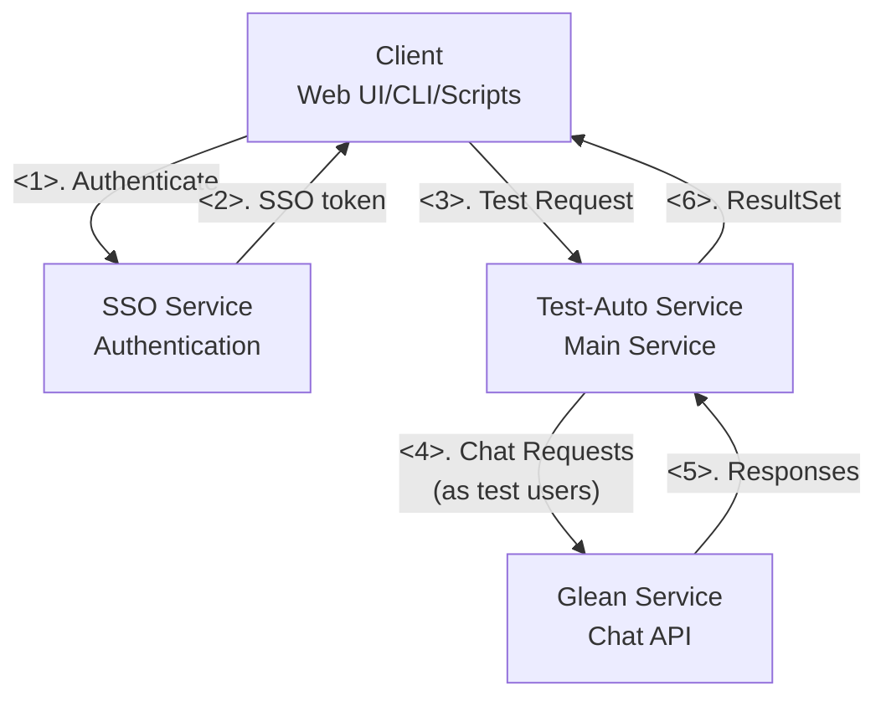
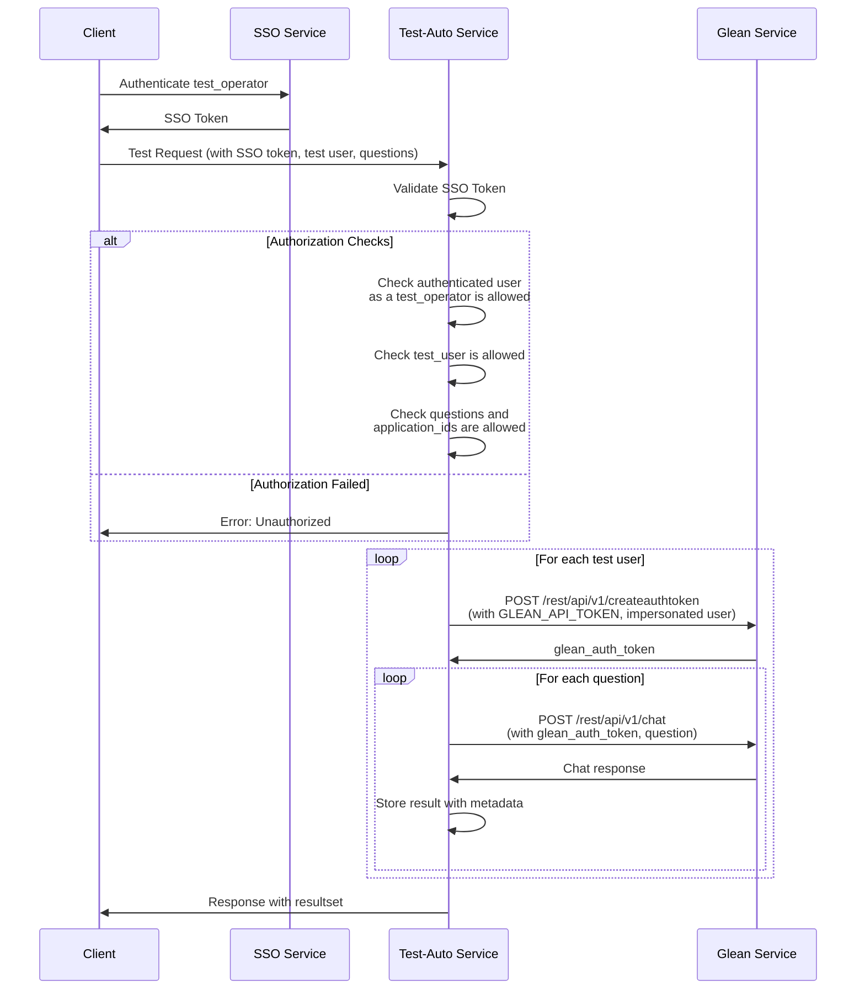

# Test Automation Service Architecture

## Overview
This document describes the architecture for an automated testing service that tests Glean chat API using multiple user accounts and predefined questions.

## Requirements
- around 20 test users for automated testing
- around 4 authorized users who can trigger tests
- around 30 predefined questions for testing
- Automated collection of responses in Excel format
- Configurable users and questions

## High-Level Architecture



## Component Details

### Client
- Authenticate test_operator and get SSO token
- Call Test-Auto Service to perform tests

### SSO Service
- Handle authentication and return SSO token

### Test-Auto Service
Main orchestration service with the following modules

### Glean Service
- Target service being tested
- Provides chat API and authentication endpoints

## Authentication & Authorization Flow



## Data Structures

### Request Format
```json
{
  "user": "test_user1",
  "application_id": "chat_kb1",
  "questions": [
    "What is machine learning?",
    "What is machine MCP?",
    "What is machine Agent?",
    "How does neural network training work?"
  ]
}
```

### Response Format
```json
{
  "test_id": "uuid-12345",
  "timestamp": "2024-01-01T00:00:00Z",
  "operated_by": "test_operator1",
  "test_user_id": "test_user1",
  "application_id": "chat_kb1",
  "status": "completed",
  "results": [
    {
      "question": "What is machine learning?",
      "answer": "Machine learning is a subset of artificial intelligence...",
      "citation_urls": [
        "https://internal-docs.com/ml-overview",
        "https://wiki.company.com/ai-basics"
      ],
      "response_time_ms": 1500,
      "timestamp": "2024-01-01T00:00:01Z",
      "status": "success",
      "statusMsg": None
    },
  ]
}
```

## Configuration Management

### Test Operator Allowlist
```yaml
test_automation_allow_config:
  test_operators:
    - test_operator1
    - test_operator2
    - test_operator3
    - test_operator4
  test_users:
    test_user1:
      questions:
        - "What is machine learning?"
        - "How does neural network training work?"
        - "What are the benefits of cloud computing?"
        - "How do I reset my password?"
        - "What is our company's mission statement?"
      application_ids:
        - "chat_kb1"
        - "app2"
        - "app3"
    test_user2:
      questions:
        - "What is machine learning?"
        - "How does neural network training work?"
        - "What are the benefits of cloud computing?"
        - "How do I reset my password?"
        - "What is our company's mission statement?"
      application_ids:
        - "chat_kb1"
        - "app2"
        - "app3"
    test_user3:
      questions:
        - "What is machine learning?"
        - "How does neural network training work?"
        - "What are the benefits of cloud computing?"
        - "How do I reset my password?"
        - "What is our company's mission statement?"
      application_ids:
        - "chat_kb1"
        - "app2"
        - "app3"
    # ... up to 20 test users
```

## Security Considerations
- All API calls authenticated through SSO
- Multi-level authorization checks:
  - Test operator must be in allowlist
  - Test users must be in allowlist
  - Questions and application_ids must be pre-approved for each test user
- Service token for Glean API stored securely (environment variable/secrets manager)
- Audit logging of all test executions