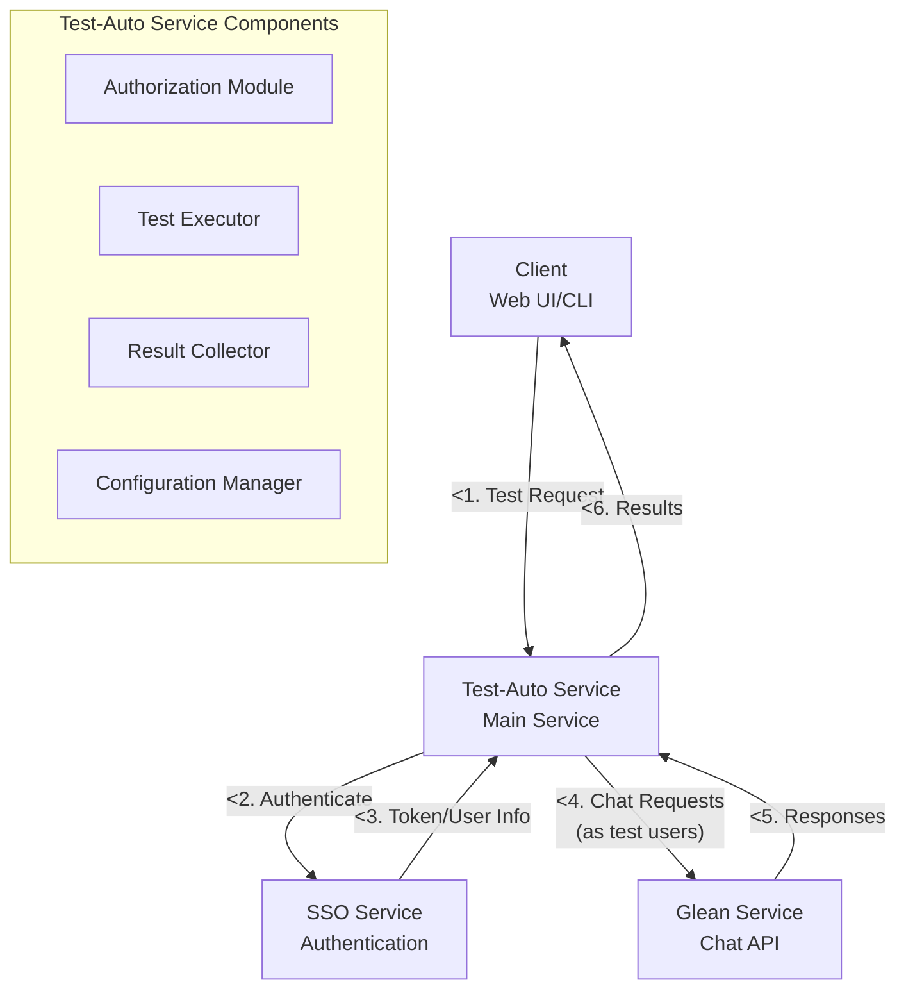
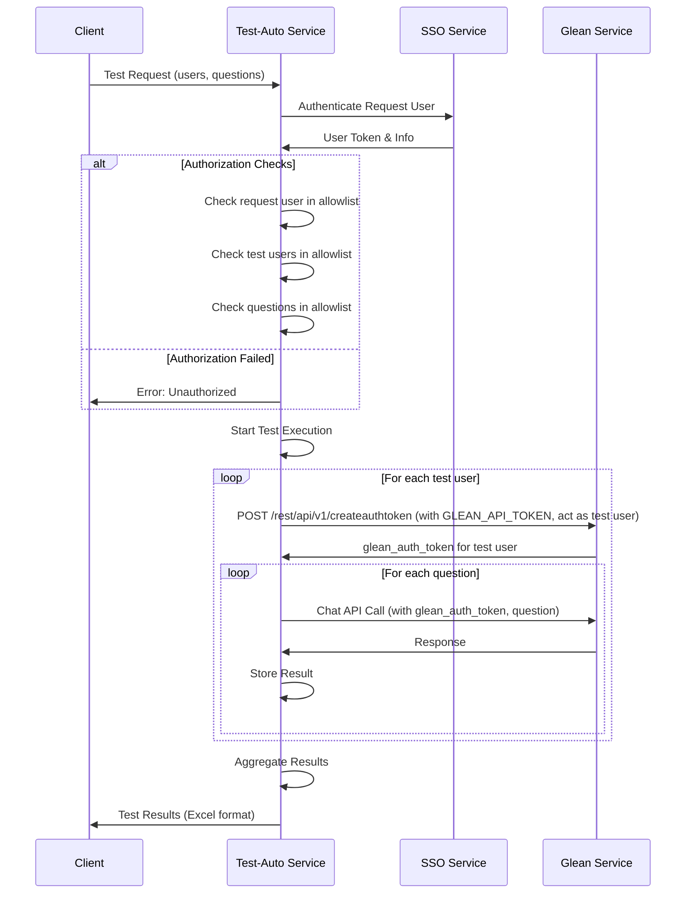
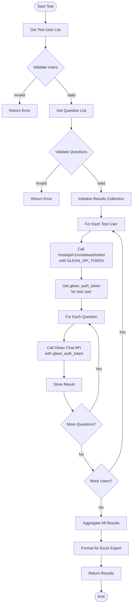

# Test Automation Service Architecture

## Overview
This document describes the architecture for an automated testing service that tests Glean chat API using multiple user accounts and predefined questions.

## Requirements
- 20 test users for automated testing
- 4 authorized users who can trigger tests
- 30 predefined questions for testing
- Automated collection of responses in Excel format
- Configurable users and questions

## High-Level Architecture



## Component Details

### Client
- **Purpose**: Interface for authorized users to trigger tests
- **Types**: Web UI or CLI or Python app
- **Functions**:
  - Submit test requests with user lists and questions
  - Display/download test results
  - Authenticate with SSO

### SSO Service
- **Purpose**: Handle authentication for all users
- **Functions**:
  - Authenticate request users
  - Manage user tokens
  - Provide user information to Test-Auto service

### Test-Auto Service
Main orchestration service with the following modules:

##### Authorization Module
- Validate request user against test-request allowlist (4 users)
- Validate test user list against test users allowlist (20 users)
- Validate questions against approved question list (30 questions)

##### Test Executor
- Loop through each test user
- For each test user, use GLEAN_API_TOKEN to call `/rest/api/v1/createauthtoken` to get user-specific auth token
- Loop through each question for each user
- Make chat API calls to Glean service using the user-specific glean_auth_token
- Handle rate limiting and error scenarios

##### Result Collector
- Collect all responses from Glean API
- Format results for Excel export
- Generate summary statistics

##### Configuration Manager
- Manage allowlists for users and questions
- Handle service configuration updates

### Glean Service
- **Purpose**: Provide chat API functionality
- **Functions**:
  - Process chat requests
  - Return AI-generated responses
  - Handle user authentication/authorization

## Authentication & Authorization Flow



## Test Execution Workflow



## Data Structures

### Request Format
```json
{
  "requested_by": "user_id",
  "test_users": ["user1", "user2", "..."],
  "questions": ["question1", "question2", "..."]
}
```

### Response Format
```json
{
  "test_id": "uuid",
  "timestamp": "2024-01-01T00:00:00Z",
  "requested_by": "user_id",
  "results": [
    {
      "test_user_id": "user1",
      "question": "What is machine learning?",
      "answer": "Machine learning is...",
      "response_time_ms": 1500,
      "timestamp": "2024-01-01T00:00:01Z"
    }
  ],
  "summary": {
    "total_users": 20,
    "total_questions": 30,
    "total_responses": 600,
    "avg_response_time_ms": 1200,
    "success_rate": 98.5
  }
}
```

### Excel Export Format
| Test User ID | Question | Answer | Response Time (ms) | Timestamp |
|-------------|----------|--------|--------------------|-----------|
| user1 | What is AI? | AI is... | 1200 | 2024-01-01T00:00:01Z |
| user1 | How does ML work? | ML works by... | 1500 | 2024-01-01T00:00:02Z |

## Configuration Management

### Test-Request Users Allowlist
```yaml
test_request_users:
  - admin1@company.com
  - admin2@company.com
  - tester1@company.com
  - tester2@company.com
```

### Test Users Allowlist
```yaml
test_users:
  - testuser1@company.com
  - testuser2@company.com
  - "..."
  - testuser20@company.com
```

### Approved Questions
```yaml
questions:
  - "What is machine learning?"
  - "How does natural language processing work?"
  - "..."
  - "What are the benefits of AI in business?"
```

### Glean API Configuration
```yaml
glean_api:
  base_url: "https://your-glean-instance.com"
  api_token: "${GLEAN_API_TOKEN}"  # Service-level token for creating auth tokens
  endpoints:
    create_auth_token: "/rest/api/v1/createauthtoken"
    chat_api: "/api/search/chat"
```

## Security Considerations
- All API calls are authenticated through SSO
- Authorization checks at multiple levels
- Rate limiting to prevent abuse
- Audit logging for all test requests
- Secure storage of user credentials and tokens

## Scalability Considerations
- Concurrent execution of tests for multiple users
- Queue management for large test requests
- Result streaming for real-time progress updates
- Database optimization for result storage
- Caching of frequently used configurations

## Error Handling
- Graceful handling of Glean API failures
- Retry mechanisms with exponential backoff
- Partial result collection if some tests fail
- Clear error messages for authorization failures
- Timeout handling for long-running tests